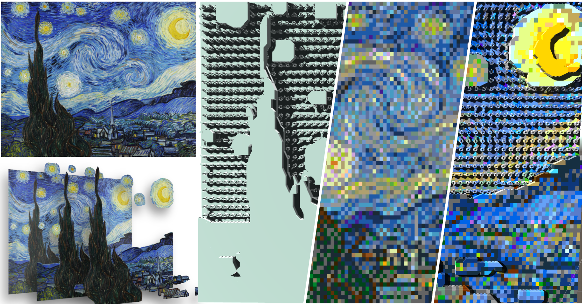
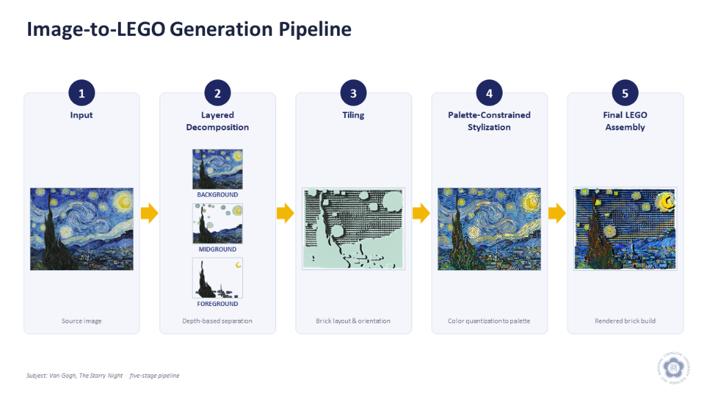
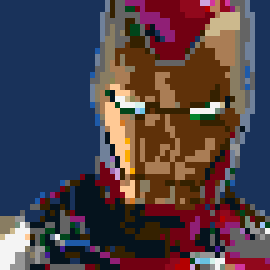
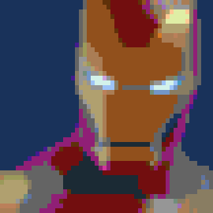

# BrickMosaic

**Multi-Layer LEGO Stylization via Tiling Optimization and Palette-Constrained Rendering**

Shao-Yun Lo, Hsiang-Yu Wang, Wei Huang, Ming-Te Chi — National Chengchi University, Taiwan

Accepted at **Computer Graphics International (CGI) 2026** (oral presentation, London). To appear in Springer LNCS.

**Project page:** https://shao-yun.github.io/BrickMosaic/



## Overview

BrickMosaic turns a single image into an assembly-aware LEGO-style mosaic. The pipeline:

1. **Layered scene representation** — SAM segmentation and Depth Anything monocular depth split the image into depth-ordered semantic layers.
2. **LEGO-aware tiling optimization** — a graph-based solver (extending TilinGNN) places bricks, with primitive decomposition and inner-contour pruning to shrink the search space.
3. **Palette-constrained stylization** — Score Distillation Sampling with a VGG-based perceptual loss under the standard 39-color LEGO palette.



## Results

- Tiling more than **10x faster** than TilinGNN (layout optimization 37.5 s → 2.9 s; candidate-graph construction 52.0 s → 9.5 s).
- Best **LPIPS (0.3883)** across 25 benchmark scenes against general pixelization methods (MYOS, SD-piXL).

| MYOS | SD-piXL | Ours |
|---|---|---|
|  |  |  |

## Code

The code is not publicly released. This repository hosts the project page.

## Citation

```
Lo, S.-Y., Wang, H.-Y., Huang, W., Chi, M.-T. "BrickMosaic: Multi-Layer LEGO Stylization via
Tiling Optimization and Palette-Constrained Rendering." Computer Graphics International (CGI) 2026.
```
